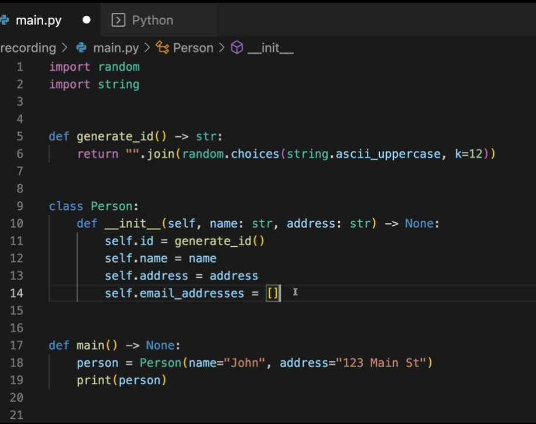
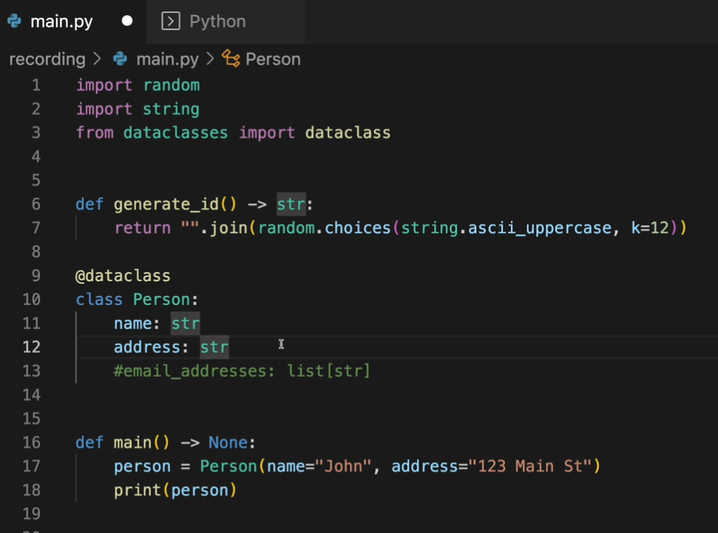
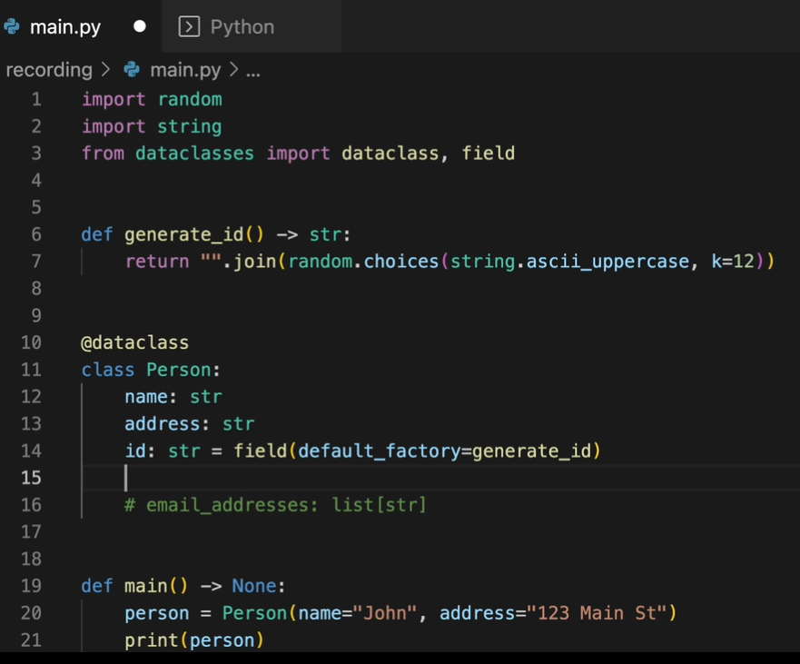

When we run the below code



we get output something like memory address.

```python
<__main__.Person object at 0x1047cdc50>
```

we do not know what present inside that. And to know about the things present inside Person object, we can use **str** and **repr** dunder methods.

Overall there is differnt way of defining classes in python. It is similar and easier to read. That is by using **_dataclasses_**.



When you run this you get

```python
Person(name='John',address='123 Main St')
```

If we want to assign a value to a class variable, 'id' for example which is a string, we use field function in dataclasses.



now the output object will also have id.

```python
Person(name='John',address='123 Main St', id='VHSDKKLJASDA')
```

you can also add bool type

```python
@dataclass
class Person:
    name: str
    address: str
    id: str = field(default_factory=generate_id)
    active: bool = True
```

you can also add list types in dataclasses. But we might be tempted to write this

```python
email_addresses: list[str] = []
```

Thats not a good idea. The way that python works is that, the empty list value is generated at interpret time once. thats the reason you should not assign empty list as default in functions. you might get some unexpected behaviour because all those empty list are basically going to refer to same object.

What you can do is assign field and add default_factory to list initializer.

```python
@dataclass
class Person:
    name: str
    address: str
    id: str = field(default_factory=generate_id)
    active: bool = True
    email_addresses: list[str] = field(default_factory=list)
```

For more information on this - see below example

Let's break this down step by step and clarify what's going on:

### Key Point: Mutable Defaults in Python

When you define a **mutable default value** (like a list or dictionary) in a Python function or a `dataclass`, Python creates that value **once** at the time the function or class is defined (interpretation time).

This means that all instances of the function or class will **share the same object** as the default value. If one instance modifies the shared object, it affects all other instances that use the same default.

### Problem With Mutable Defaults

When you write this:

```python
email_addresses: list[str] = []
```

You are assigning a **shared mutable list** as the default value for `email_addresses`. This means all instances of the `Person` class will share the same list.

For example:

```python
@dataclass
class Person:
    name: str
    email_addresses: list[str] = []

# Create two instances
p1 = Person(name="Alice")
p2 = Person(name="Bob")

# Add an email to p1's list
p1.email_addresses.append("alice@example.com")

# Check p2's email_addresses
print(p2.email_addresses)  # ['alice@example.com']
```

This happens because `p1.email_addresses` and `p2.email_addresses` refer to the same list object.

### Solution: Use `field` with `default_factory`

To avoid this issue, use the `field` function with `default_factory`. This ensures that a **new list** is created for each instance of the class.

Here's the corrected code:

```python
from dataclasses import dataclass, field

@dataclass
class Person:
    name: str
    email_addresses: list[str] = field(default_factory=list)
```

With this change:

1. **Each instance of `Person` gets its own list**.
2. Modifying the `email_addresses` of one instance does not affect the others.

Example:

```python
# Create two instances
p1 = Person(name="Alice")
p2 = Person(name="Bob")

# Add an email to p1's list
p1.email_addresses.append("alice@example.com")

# Check p2's email_addresses
print(p2.email_addresses)  # []
```

### Why This Happens

- **Default Value Behavior**: When `email_addresses: list[str] = []` is used, the empty list is created once and shared.
- **`default_factory`**: This ensures a new list is created each time a new instance is created.

### Why `field(default_factory=list)` Works

The `default_factory` parameter of the `field` function takes a callable (like `list`) that is called to produce a new default value. So, every time you create an instance, `list()` is called to generate a fresh, independent list.

---

### Final Thoughts

It is **true** that using mutable default arguments or attributes directly can lead to unexpected behavior. Always use `field(default_factory=...)` for mutable defaults in `dataclasses` to avoid shared state issues.

### next concept is INIT=FALSE

The `init=False` parameter in the `field` function is used to exclude a specific attribute from the class initializer (`__init__` method). This is particularly useful when you want to control the value of a field programmatically (e.g., generating it internally) rather than requiring the user to provide it during instance creation.

### How `init=False` Works

When you define a field with `init=False`, it will:

1. **Not be included as a parameter** in the generated `__init__` method of the dataclass.
2. Still exist as an attribute in the class and can be set manually or programmatically.

---

### Example Without `init=False`

If you have a field like this:

```python
from dataclasses import dataclass

@dataclass
class Person:
    name: str
    id: str  # Requires id to be passed during initialization

# Initialization
p = Person(name="Alice", id="12345")
print(p)  # Person(name='Alice', id='12345')
```

Here, the `id` field is included in the `__init__` method, and you must provide a value for it when creating a `Person` instance.

---

### Using `init=False`

When you don't want the user to pass `id` during initialization and instead want it to be generated internally:

```python
from dataclasses import dataclass, field
import uuid

@dataclass
class Person:
    name: str
    id: str = field(default_factory=lambda: str(uuid.uuid4()), init=False)

# Initialization
p = Person(name="Alice")
print(p)  # Person(name='Alice', id='a3f9e72b-76e5-4a39-9e1a-27c92b543a65')
```

- **`id` is excluded from the `__init__` method** because of `init=False`.
- The `id` field is still part of the class, and its value is set using the `default_factory` function, which generates a UUID.

---

### Why Use `init=False`?

1. **Prevent Manual Initialization**: You don't want users to set this field manually; instead, it should be managed internally.
2. **Generated or Derived Attributes**: Fields like `id`, `timestamp`, or other computed values can be excluded from the initializer and automatically set using a default factory or a post-initialization method.
3. **Encapsulation**: It enforces better control over how certain attributes are managed.

---

### Example With Manual Post-Initialization

You can also use `init=False` in combination with a `__post_init__` method to set the value programmatically:

```python
from dataclasses import dataclass, field

@dataclass
class Person:
    name: str
    id: str = field(init=False)

    def __post_init__(self):
        self.id = "Generated_" + self.name.upper()

# Initialization
p = Person(name="Alice")
print(p)  # Person(name='Alice', id='Generated_ALICE')
```

---

### Summary

- Use `init=False` when you don't want a field to appear in the constructor (`__init__`).
- This is often combined with `default_factory` or a `__post_init__` method to set the field's value programmatically.
- It helps keep certain fields private to the class logic and avoids requiring unnecessary inputs during initialization.

You can define a new variable `search_string` in your `Person` class and populate it using the `__post_init__` method. The `__post_init__` method is a special method in dataclasses that gets called immediately after the dataclass's `__init__` method. It is commonly used to perform additional setup or derive values for fields based on other fields.

Here’s how you can modify your `Person` class to include `search_string`:

### Implementation

```python
from dataclasses import dataclass, field

# Example generate_id function
def generate_id():
    import uuid
    return str(uuid.uuid4())

@dataclass
class Person:
    name: str
    address: str
    id: str = field(default_factory=generate_id)
    active: bool = True
    email_addresses: list[str] = field(default_factory=list)
    search_string: str = field(init=False)  # Exclude from __init__

    def __post_init__(self):
        # Combine name and address to create the search string
        self.search_string = f"{self.name} {self.address}"
```

### Explanation of Changes

1. **Define `search_string`**:

   - It is defined with `init=False` so that it is not part of the `__init__` method and users don't need to provide it during object creation.
   - It will be initialized programmatically in the `__post_init__` method.

2. **Populate `search_string` in `__post_init__`**:
   - After the instance is created (and fields like `name` and `address` are initialized), the `__post_init__` method is called.
   - Inside this method, `search_string` is set to a combination of `name` and `address`.

### Usage Example

```python
# Create an instance of Person
p = Person(name="Alice", address="123 Wonderland Ave")

# Print the attributes
print(p.name)          # Alice
print(p.address)       # 123 Wonderland Ave
print(p.id)            # Randomly generated ID
print(p.search_string) # Alice 123 Wonderland Ave
```

### Why Use `__post_init__` for This?

- **Derived Values**: `search_string` is derived from `name` and `address`, so it doesn't make sense to initialize it manually.
- **Encapsulation**: Using `__post_init__`, you ensure that `search_string` is always consistent with `name` and `address`.
- **Automatic Update**: If you modify `name` or `address` after object creation, you can create a method to recalculate `search_string` to reflect the changes.

---

### Additional Considerations

If `search_string` needs to update dynamically when `name` or `address` changes, you'll need to override the `__setattr__` method or use a property.

To ensure `search_string` updates dynamically when `name` or `address` changes, you can use a **property** or override the `__setattr__` method. Here's an example of both approaches:

---

### Using a Property

The `search_string` attribute can be defined as a **property** that recalculates its value whenever `name` or `address` is accessed.

```python
from dataclasses import dataclass, field

# Example generate_id function
def generate_id():
    import uuid
    return str(uuid.uuid4())

@dataclass
class Person:
    name: str
    address: str
    id: str = field(default_factory=generate_id)
    active: bool = True
    email_addresses: list[str] = field(default_factory=list)

    @property
    def search_string(self):
        # Dynamically return the combined string
        return f"{self.name} {self.address}"

# Usage
p = Person(name="Alice", address="123 Wonderland Ave")
print(p.search_string)  # Alice 123 Wonderland Ave

# Update the name and address
p.name = "Bob"
p.address = "456 Elm St"
print(p.search_string)  # Bob 456 Elm St
```

---

### Using `__setattr__` for Dynamic Updates

By overriding `__setattr__`, you can automatically update `search_string` whenever `name` or `address` changes.

```python
from dataclasses import dataclass, field

# Example generate_id function
def generate_id():
    import uuid
    return str(uuid.uuid4())

@dataclass
class Person:
    name: str
    address: str
    id: str = field(default_factory=generate_id)
    active: bool = True
    email_addresses: list[str] = field(default_factory=list)
    search_string: str = field(init=False)

    def __post_init__(self):
        # Initialize search_string after object creation
        self.search_string = f"{self.name} {self.address}"

    def __setattr__(self, key, value):
        # Set the attribute normally
        super().__setattr__(key, value)

        # Update search_string dynamically if name or address changes
        if key in {"name", "address"}:
            super().__setattr__("search_string", f"{self.name} {self.address}")

# Usage
p = Person(name="Alice", address="123 Wonderland Ave")
print(p.search_string)  # Alice 123 Wonderland Ave

# Update the name and address
p.name = "Bob"
p.address = "456 Elm St"
print(p.search_string)  # Bob 456 Elm St
```

---

### Comparing the Approaches

| **Feature**         | **Property**                                       | **`__setattr__`**                                           |
| ------------------- | -------------------------------------------------- | ----------------------------------------------------------- |
| **Ease of Use**     | Easier and cleaner; no manual updates.             | Slightly more complex to implement.                         |
| **Performance**     | Recomputed every time `search_string` is accessed. | Updated only when `name` or `address` changes.              |
| **Dynamic Updates** | Yes, but recalculated each time.                   | Yes, updated automatically when changes occur.              |
| **Recommended For** | Read-only attributes or simple logic.              | Situations where updates should be automatic and efficient. |

---

### Which Should You Choose?

- **Use Property**: If `search_string` is only used occasionally and recalculating it is lightweight.
- **Use `__setattr__`**: If `search_string` is frequently accessed or performance is a concern.

In Python's `dataclasses`, the `repr` parameter of the `field` function controls whether a particular field is included in the automatically generated `__repr__` method of the class. By default, `repr=True`, meaning the field will be included in the string representation of the class. Setting `repr=False` excludes the field from the `__repr__` output.

### When to Use `repr=False`

1. **Excluding Derived/Redundant Fields**: If a field like `search_string` is derived from other fields (`name` and `address`), it may not add value to the representation and can be omitted.
2. **Hiding Sensitive Data**: For fields containing sensitive or irrelevant information, you can exclude them from `__repr__` to keep the output concise or secure.

---

### Example with `repr=False`

```python
from dataclasses import dataclass, field

# Example generate_id function
def generate_id():
    import uuid
    return str(uuid.uuid4())

@dataclass
class Person:
    name: str
    address: str
    id: str = field(default_factory=generate_id)
    active: bool = True
    email_addresses: list[str] = field(default_factory=list)
    search_string: str = field(init=False, repr=False)  # Exclude from repr

    def __post_init__(self):
        # Initialize search_string
        self.search_string = f"{self.name} {self.address}"

# Usage
p = Person(name="Alice", address="123 Wonderland Ave")
print(p)  # Person(name='Alice', address='123 Wonderland Ave', id='some-id', active=True, email_addresses=[])
print(p.search_string)  # Alice 123 Wonderland Ave
```

### Output:

```plaintext
Person(name='Alice', address='123 Wonderland Ave', id='some-id', active=True, email_addresses=[])
Alice 123 Wonderland Ave
```

- The `search_string` field exists and is usable in the code, but it is **not shown in the `__repr__` output**.

---

### Advantages of Using `repr=False`

1. **Cleaner Output**: It simplifies the string representation of the object by excluding non-essential or derived fields.
2. **Security**: If the field contains sensitive or internal data (e.g., passwords, tokens), `repr=False` can help hide it from casual inspection.

---

### When **Not** to Use `repr=False`

If the field provides valuable information for debugging or inspecting the object, it’s better to leave it in the `__repr__`.

---

### Combining with Other Features

Here’s a class using `repr=False` for `search_string` and `init=False` to derive its value dynamically:

```python
@dataclass
class Person:
    name: str
    address: str
    id: str = field(default_factory=generate_id)
    active: bool = True
    email_addresses: list[str] = field(default_factory=list)
    search_string: str = field(init=False, repr=False)

    def __post_init__(self):
        self.search_string = f"{self.name} {self.address}"

# Usage
p = Person(name="Alice", address="123 Wonderland Ave")
print(p)  # Person(name='Alice', address='123 Wonderland Ave', id='some-id', active=True, email_addresses=[])
print(p.search_string)  # Alice 123 Wonderland Ave
```

---

### Summary

- **`repr=False`** excludes the field from the `__repr__` method of the dataclass.
- It is useful for derived, redundant, or sensitive fields.
- The field remains fully functional and accessible in the object, just not included in its printed representation.

Using an underscore (e.g., `_search_string`) as a prefix in Python signifies that the variable is **intended to be internal to the class**. It is a convention (not enforced by Python) that suggests the variable should not be accessed directly from outside the class. This is useful for **hiding implementation details** or **preventing accidental modification**.

To make `_search_string` internal while still providing access when needed, you can use the following approach:

---

### Implementation Example

```python
from dataclasses import dataclass, field

# Example generate_id function
def generate_id():
    import uuid
    return str(uuid.uuid4())

@dataclass
class Person:
    name: str
    address: str
    id: str = field(default_factory=generate_id)
    active: bool = True
    email_addresses: list[str] = field(default_factory=list)
    _search_string: str = field(init=False, repr=False)  # Internal field

    def __post_init__(self):
        # Initialize _search_string
        self._search_string = f"{self.name} {self.address}"

    @property
    def search_string(self):
        """Publicly expose _search_string as a read-only property."""
        return self._search_string

    def update_search_string(self):
        """Update _search_string dynamically."""
        self._search_string = f"{self.name} {self.address}"

# Usage
p = Person(name="Alice", address="123 Wonderland Ave")
print(p.search_string)  # Alice 123 Wonderland Ave
print(p._search_string)  # Direct access is possible but not recommended

# Change name and address
p.name = "Bob"
p.address = "456 Elm St"
p.update_search_string()  # Explicitly call the update method
print(p.search_string)  # Bob 456 Elm St
```

---

### Key Points

1. **Prefix `_`**:

   - `_search_string` indicates that the field is for internal use.
   - It discourages direct access from outside the class but does not enforce it.

2. **Expose via a Property**:

   - The `search_string` property provides controlled access to `_search_string` as a **read-only attribute**.
   - To modify `_search_string`, you can provide explicit methods (like `update_search_string`).

3. **Avoid Direct Access**:
   - While it’s still possible to access `_search_string` directly (e.g., `p._search_string`), the convention signals that it’s not intended for public use.

---

### Why Use an Underscore?

- **Encapsulation**: Helps separate internal implementation from public interface.
- **Reduced Risk**: Prevents accidental external modification or reliance on internal details.
- **Improved Clarity**: Makes it clear to other developers (or your future self) which attributes are part of the internal state.

---

### Alternative: Making it Strictly Private

If you want to strictly enforce that `_search_string` cannot be accessed or modified directly, you can use **name mangling** by prefixing it with `__` (double underscores):

```python
@dataclass
class Person:
    name: str
    address: str
    id: str = field(default_factory=generate_id)
    active: bool = True
    email_addresses: list[str] = field(default_factory=list)
    __search_string: str = field(init=False, repr=False)  # Private field

    def __post_init__(self):
        self.__search_string = f"{self.name} {self.address}"

    @property
    def search_string(self):
        return self.__search_string
```

Here, `__search_string` is truly private, and accessing it directly (`p.__search_string`) will raise an `AttributeError`.

---

### When to Use Each

1. **Single Underscore (`_search_string`)**:

   - Use when you want the field to be internal but don't need strict privacy.
   - Appropriate for most use cases in Python.

2. **Double Underscore (`__search_string`)**:
   - Use when you want strict name mangling to prevent access or modification.
   - Use sparingly, as it can make debugging or extending the class more cumbersome.

---

Yes, you're absolutely correct! While using **double underscores (`__`)** in Python introduces **name mangling** to make an attribute private, it doesn't make it completely inaccessible. Instead, Python modifies the name of the attribute internally to include the class name as a prefix. This is a deliberate design decision to avoid name conflicts in subclasses rather than enforce strict privacy.

### How Name Mangling Works

When you define an attribute with double underscores, Python renames it internally by prefixing the attribute name with `_ClassName`. This means you can still access the attribute if you know the mangled name.

---

### Example of Name Mangling

```python
@dataclass
class Person:
    name: str
    address: str
    __search_string: str = field(init=False, repr=False)  # Private field

    def __post_init__(self):
        self.__search_string = f"{self.name} {self.address}"

    @property
    def search_string(self):
        return self.__search_string
```

#### Accessing the Mangled Attribute

```python
p = Person(name="Alice", address="123 Wonderland Ave")
print(p.search_string)  # Public access through property
# Output: Alice 123 Wonderland Ave

# Access the mangled name directly
print(p._Person__search_string)
# Output: Alice 123 Wonderland Ave
```

---

### Why Does This Work?

- When you define `__search_string`, Python changes its name internally to `_Person__search_string`.
- This avoids accidental name conflicts in subclasses that might define their own `__search_string`.
- You can directly access the mangled attribute using `_ClassName__attribute`.

---

### Key Points About Name Mangling

1. **Not True Privacy**: Double underscores do not make attributes strictly private; they just add a layer of obfuscation.
2. **Intended for Subclass Protection**: Name mangling is primarily designed to avoid accidental name conflicts in subclasses.
3. **Still Accessible**: Developers can still access the mangled name if needed, though this is not recommended for regular usage.

---

### When to Use Single vs. Double Underscore

- Use **single underscore (`_search_string`)** for internal attributes that are meant to be private by convention but can still be accessed if needed.
- Use **double underscore (`__search_string`)** when you want to avoid accidental name conflicts in subclasses or enforce stronger obfuscation.

---

### Practical Advice

Relying on `__search_string` for stricter encapsulation can sometimes complicate debugging or future code maintenance. It's better to trust the convention of a single underscore (`_search_string`) unless you have a specific reason to prevent subclass name conflicts.

The `kw_only` parameter in Python's `dataclasses` module is used to enforce **keyword-only arguments** for the fields of a dataclass. When `kw_only=True` is set for a field, it means that the field must be passed as a keyword argument when creating an instance of the dataclass. This helps with clarity and readability, especially in cases where the arguments could be confusing if passed positionally.

### How `kw_only` Works

- **Without `kw_only=True`**: Fields are typically passed either positionally or as keyword arguments.
- **With `kw_only=True`**: The field **must** be passed as a keyword argument, preventing positional arguments for that field.

This is useful for cases where you want to avoid ambiguity, improve readability, or enforce clarity in how values are assigned to the dataclass fields.

### Example

Here's a basic example of how to use `kw_only=True`:

```python
from dataclasses import dataclass, field

@dataclass(kw_only=True)
class Person:
    name: str
    address: str
    id: str = field(default_factory=generate_id)
    active: bool = True
    email_addresses: list[str] = field(default_factory=list)

# Correct usage
p = Person(name="Alice", address="123 Wonderland Ave")
print(p)

# Incorrect usage (raises an error)
# p = Person("Alice", "123 Wonderland Ave")  # TypeError: Person() takes no positional arguments
```

### Key Points:

1. **Enforcing Keyword-Only Arguments**: When you use `kw_only=True`, **all fields** in the dataclass become keyword-only arguments, meaning they can **only** be passed as keyword arguments.

2. **Avoiding Positional Argument Ambiguity**: This can be helpful when you have multiple arguments of the same type or when you want to make the code more readable by forcing explicit naming.

3. **Only in Dataclasses (Version 3.10 and Above)**: The `kw_only` argument was introduced in Python 3.10 and works only for dataclasses.

---

### Example with `field` and `kw_only`

If you have a more complex dataclass and only want to make specific fields keyword-only while keeping others positional, you can do that with `field(kw_only=True)`.

```python
from dataclasses import dataclass, field

def generate_id():
    import uuid
    return str(uuid.uuid4())

@dataclass
class Person:
    name: str
    address: str
    id: str = field(default_factory=generate_id)
    active: bool = True
    email_addresses: list[str] = field(default_factory=list)
    phone_number: str = field(kw_only=True)  # This field is keyword-only

# Correct usage
p = Person(name="Alice", address="123 Wonderland Ave", phone_number="123-456-7890")
print(p)

# Incorrect usage (raises an error)
# p = Person("Alice", "123 Wonderland Ave", "123-456-7890")  # TypeError: Person() got an unexpected keyword argument 'phone_number'
```

### When to Use `kw_only`:

- When you want to make sure that all arguments are explicitly named.
- When your class has a lot of arguments and you want to avoid confusion or mistakes when initializing.
- When you want to ensure the constructor is always clear and readable by forcing all fields to be named.

---

The `frozen` concept in Python's `dataclasses` module allows you to create **immutable** instances of a dataclass. When a dataclass is defined with `frozen=True`, its fields become read-only after the object is created. This means that you cannot modify any of the attributes of the dataclass once the object is instantiated, essentially making the object **immutable**.

### How Does `frozen=True` Work?

When you set `frozen=True`, Python does the following:

1. **Prevents Assignment to Attributes**: Once an instance is created, you cannot assign new values to any fields of the dataclass.
2. **Makes Object Hashable**: Dataclasses with `frozen=True` are hashable, meaning they can be used as keys in dictionaries or added to sets (assuming all fields are hashable).
3. **Enforces Immutability**: You can't mutate any of the fields after object creation, and this can be useful in scenarios where you want to ensure the integrity of the object state.

### Example of `frozen=True`

```python
from dataclasses import dataclass

@dataclass(frozen=True)
class Person:
    name: str
    address: str

# Creating an instance
p = Person(name="Alice", address="123 Wonderland Ave")
print(p)

# Attempting to modify an attribute will raise an error
# p.name = "Bob"  # Raises: FrozenInstanceError: cannot assign to field 'name'
```

In this case, after creating the `Person` object, you cannot modify `p.name` or `p.address`. Trying to do so will raise a `FrozenInstanceError`.

---

The `frozen` parameter in Python's `dataclasses` module is used to make a dataclass **immutable**. When `frozen=True` is set, the attributes of the dataclass cannot be modified after the instance is created. This ensures that the data remains constant throughout its lifecycle, making the class behave like a **tuple** or an immutable object.

---

### **Key Features of `frozen=True`**

1. **Immutability**: Once an object is instantiated, its attributes cannot be changed.
2. **Hashability**: If all fields in the dataclass are hashable, a frozen dataclass can be used as a key in dictionaries or stored in sets.
3. **Error on Mutation**: Any attempt to modify an attribute of a frozen dataclass results in a `FrozenInstanceError`.

---

### **Effect on `__post_init__`**

When `frozen=True` is used, the `__post_init__` method also cannot modify the instance's attributes directly. Since the instance is frozen at the time of its creation, any attempt to assign a value to an attribute in `__post_init__` will raise a `FrozenInstanceError`.

### Example with `frozen=True`:

```python
from dataclasses import dataclass

@dataclass(frozen=True)
class ImmutablePerson:
    name: str
    age: int

# Example Usage
person = ImmutablePerson(name="Alice", age=30)
print(person)

# Attempting to modify an attribute raises an error
# person.age = 31  # Raises FrozenInstanceError
```

---

### **How `frozen=True` Affects `__post_init__`**

Because `frozen=True` enforces immutability, you cannot modify attributes in `__post_init__`:

```python
from dataclasses import dataclass

@dataclass(frozen=True)
class ImmutablePerson:
    name: str
    age: int
    search_string: str = ""

    def __post_init__(self):
        # Attempting to modify attributes raises an error
        # self.search_string = f"{self.name} - {self.age}"  # Raises FrozenInstanceError
        pass
```

---

### **Alternative to Modify Attributes in `__post_init__`**

To work around the restriction of modifying attributes in `__post_init__`, you can use `object.__setattr__`. This bypasses the immutability enforcement during the `__post_init__` phase, allowing you to make controlled updates.

```python
from dataclasses import dataclass

@dataclass(frozen=True)
class ImmutablePerson:
    name: str
    age: int
    search_string: str = ""

    def __post_init__(self):
        # Use object.__setattr__ to modify attributes in a frozen dataclass
        object.__setattr__(self, 'search_string', f"{self.name} - {self.age}")

# Example Usage
person = ImmutablePerson(name="Alice", age=30)
print(person.search_string)  # Outputs: Alice - 30
```

---

### **Why Use `frozen=True`?**

- **Safety**: It prevents accidental modification of data, making the class more predictable.
- **Hashability**: It allows the class to be used in sets or as dictionary keys.
- **Consistency**: Ideal for cases where the object's state should remain constant after creation.

---

### **When Not to Use `frozen=True`**

- If the class needs to allow attribute updates after creation.
- If extensive modifications are needed during initialization (e.g., in `__post_init__`).

---

### **Summary of Alternatives**

1. **Use `object.__setattr__`**: Allows controlled modification in `__post_init__`.
2. **Avoid `frozen=True`**: If you need to frequently update attributes, stick with the default mutable behavior.
3. **Combine with `@property`**: Use `frozen=True` for immutability but provide controlled access to derived attributes via properties.

---

### PROPERTY CONCEPT

Here’s a detailed example implementing your request. It includes the `VideoClip` class with a `duration` property (including a setter), the `VideoProject` class with a `total_length` property, and a main function to demonstrate the functionality.

### Code Example:

```python
from dataclasses import dataclass, field
from typing import List


@dataclass
class VideoClip:
    title: str
    minutes: int
    seconds: int

    @property
    def duration(self) -> int:
        """
        Get the duration of the video clip in seconds.
        """
        return self.minutes * 60 + self.seconds

    @duration.setter
    def duration(self, total_seconds: int):
        """
        Set the duration of the video clip, updating minutes and seconds.
        """
        self.minutes = total_seconds // 60
        self.seconds = total_seconds % 60


@dataclass
class VideoProject:
    title: str
    clips: List[VideoClip] = field(default_factory=list)

    @property
    def total_length(self) -> int:
        """
        Get the total length of all video clips in the project in seconds.
        """
        return sum(clip.duration for clip in self.clips)

    def add_clip(self, clip: VideoClip):
        """
        Add a new clip to the project.
        """
        self.clips.append(clip)


# Main function
def main():
    # Create VideoClip instances
    clip1 = VideoClip(title="Clip 1", minutes=2, seconds=30)
    clip2 = VideoClip(title="Clip 2", minutes=3, seconds=45)

    # Create VideoProject and add clips
    project = VideoProject(title="My Video Project")
    project.add_clip(clip1)
    project.add_clip(clip2)

    # Print total length before using duration setter
    print(f"Total Length Before Update: {project.total_length} seconds")

    # Update duration of clip1 using the setter
    clip1.duration = 300  # 5 minutes

    # Print total length after using duration setter
    print(f"Total Length After Update: {project.total_length} seconds")


if __name__ == "__main__":
    main()
```

---

### Explanation:

1. **`VideoClip` Class**:

   - **Attributes**:
     - `title`: Title of the clip.
     - `minutes`: Duration in minutes.
     - `seconds`: Duration in seconds.
   - **`duration` Property**:
     - **Getter**: Converts `minutes` and `seconds` into total seconds.
     - **Setter**: Updates `minutes` and `seconds` based on the total seconds provided.

2. **`VideoProject` Class**:

   - **Attributes**:
     - `title`: Title of the video project.
     - `clips`: A list of `VideoClip` objects.
   - **`total_length` Property**:
     - Calculates the total length of all clips in the project in seconds by summing up the `duration` of each clip.

3. **Main Function**:
   - Creates two `VideoClip` objects (`clip1` and `clip2`).
   - Combines them into a `VideoProject`.
   - Prints the total length of the project before and after modifying `clip1`'s duration using the setter.

---

### Output:

```plaintext
Total Length Before Update: 375 seconds
Total Length After Update: 645 seconds
```

---

### Key Points:

1. **Property Usage**:

   - The `duration` property allows clean encapsulation for handling duration in seconds while storing the data as `minutes` and `seconds`.
   - The setter ensures that changes to the duration are consistently reflected in both `minutes` and `seconds`.

2. **Dynamic Updates**:
   - Changes to individual clip durations dynamically affect the total length of the `VideoProject` due to the `total_length` property.

This implementation demonstrates clean and modular use of `property` with data classes, providing a flexible and clear way to manage video projects and their durations.

---

### Difference Between `str` and `repr` in Python

The difference between `str` and `repr` in Python lies in their intended purpose and the way they represent objects.

### **1. Purpose**

- **`str`**: Provides a **user-friendly** string representation of an object. It is designed to be more readable and used for display to end-users.
- **`repr`**: Provides an **unambiguous** and often **developer-oriented** string representation of an object. It is meant to be as informative as possible and is usually used for debugging.

---

### **2. Implementation**

- You can define custom `__str__` and `__repr__` methods in your class to control their behavior.
- If `__str__` is not implemented, Python will fall back to `__repr__` for `str()` calls.

---

### **3. Example**

```python
class Point:
    def __init__(self, x, y):
        self.x = x
        self.y = y

    def __str__(self):
        # User-friendly representation
        return f"Point({self.x}, {self.y})"

    def __repr__(self):
        # Unambiguous representation
        return f"Point(x={self.x}, y={self.y})"

# Create an instance
p = Point(3, 4)

# Display representations
print(str(p))   # Calls __str__: Point(3, 4)
print(repr(p))  # Calls __repr__: Point(x=3, y=4)
```

---

### **4. Key Differences**

| **Aspect**   | **`str`**                      | **`repr`**                             |
| ------------ | ------------------------------ | -------------------------------------- |
| **Purpose**  | Readable, user-friendly output | Unambiguous, developer-oriented output |
| **Audience** | End-users                      | Developers                             |
| **Fallback** | Falls back to `__repr__`       | Does not fall back to `__str__`        |
| **Usage**    | `print()` or `str()`           | Debugging or `repr()` function         |

---

### **5. Example with Built-in Types**

```python
# Example with integers
num = 42
print(str(num))   # '42' (Readable for users)
print(repr(num))  # '42' (Same for simple types)

# Example with strings
text = "Hello\nWorld"
print(str(text))   # 'Hello\nWorld'
print(repr(text))  # "'Hello\\nWorld'" (Unambiguous, includes escape characters)
```

---

### **6. When to Use**

- Use **`str`** when you want a **human-readable description** of an object (e.g., in user interfaces or reports).
- Use **`repr`** for **debugging and logging**, where the representation should clearly indicate what the object is, often including type information.

---

### **7. Practical Example**

```python
from datetime import datetime

now = datetime.now()

print(str(now))   # Human-readable: '2025-01-13 10:15:30.123456'
print(repr(now))  # Technical: 'datetime.datetime(2025, 1, 13, 10, 15, 30, 123456)'
```

In this case:

- `str()` is designed for readability.
- `repr()` is designed to give all details necessary to recreate the object.

---

### **Summary**

- Use `str` for user-facing string representations.
- Use `repr` for debugging, logging, or when you need an exact representation of the object.
