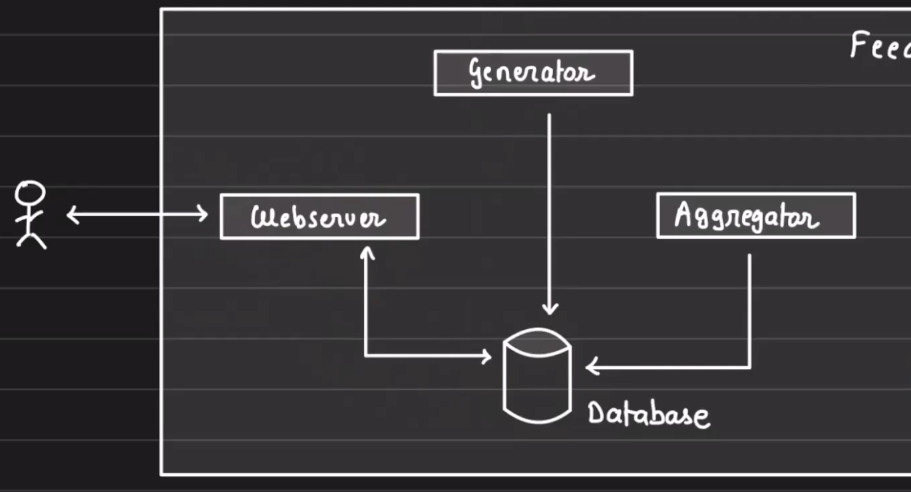

# How to Approach System Design?

System design is highly practical, and there is a structured way to tackle it. Take **baby steps**, no matter what!

---

## 1. Understand the Problem Statement

- Without thoroughly understanding the problem statement, it is easy to **digress** from the main problem.

---

## 2. Break It Down Into Components (Essential)

- **Do not create components for the sake of it.**
- **Create components that are essential** and directly address the problem.

**Example: Designing Facebook**

- Components/Features:
  - **Auth**, **Notification**, **Feed**, **Gamification**.

When the problem statement is large, **break it down** into smaller components to tackle them one at a time.

---

## 3. Dissect Each Component (If Required)

For example, the **Feed** component might have:

- **Generator**
- **Aggregator**
- **Webserver**

---

### For Each Sub-Component, Address:

1. **Database and Caching**
2. **Scaling and Fault Tolerance**
3. **Async Processing (Delegation)**
4. **Communication Between Components**

Repeat the process for each sub-component.
