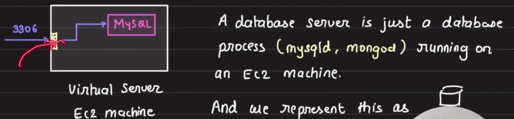
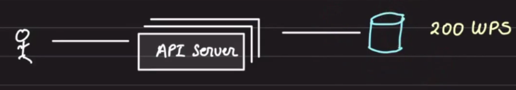
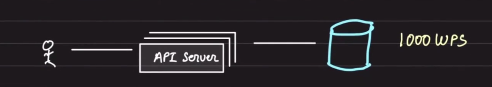

# Database Scaling Techniques

Databases are the most important component of any system. They can make or break the entire system. Hence, it is critical to understand how databases can be scaled.

These techniques are applicable to most databases, including relational and non-relational ones.

## Vertical Scaling

- Add more CPU, RAM, or SSD (disk) to the database server.
- Requires downtime during reboot.
- Increases the system's ability to handle more load ("scale").
- Limited by physical hardware constraints.

---

## Horizontal Scaling: Read Replicas

- **When to use:** Ideal when the read-to-write ratio is approximately 90:10.
- **How it works:**
  - Move reads to other database servers so that the "master" is free to handle writes.
  - API servers should be configured to connect to the appropriate database to execute queries.
- **Replication Overview:**

  - Changes on the master database need to be sent to replicas to maintain consistency.
  - Two models of replication:

    1. **Synchronous Replication**  
       

       - Strong consistency.
       - Slower writes.
       - Zero replication lag.

    2. **Asynchronous Replication**  
       
       - Faster writes.
       - Eventual consistency.
       - Some replication lag.

---

## Horizontal Scaling: Sharding

- **Why shard:** When one node cannot handle the data or load, the data is split into multiple exclusive subsets (shards). Writes for a particular row/document will go to one specific shard.

  

- **Key Points:**
  - Some databases have a proxy to handle routing to the appropriate shard.
  - Each shard can have its own replica setup if needed.

---

## Implementation Tasks

### 1. Implement Replica for Database

- Set up two databases.
- Configure the API server:
  - Separate endpoints for read and write operations.
  - Route reads to the replica and writes to the master.

### 2. Implement Sharding for Database

- Partition the data into multiple shards.
- Ensure that the API server:
  - Determines which shard to write/read based on a sharding key.
  - Routes queries accordingly.
- Optional: Add replicas to each shard for improved fault tolerance and scalability.

Sharding and Partitioning

Sharding: method of distributing data across multiple machines
Partitioning: splitting a subset of data within the same instance

How a database is scaled?

A database server is just a database process (mysql, mongodb) running on an EC2 machine using a port.

You put your database in production, serving real traffic. (100 wps - writes per second)

you are getting more users, that your DB is unable to manage you scale up your DB.. give it more CPU, RAM, Disk.

now it can handle 200 wps.

you product went viral and your bulky database is unable to handle the load, so you scale up again.

2 clicks in gcp or aws, we scaled. now it can handle 1000 wps.

But after a certain stage you know you would not be able to scale "up" your DB because "Vertical Scaling" has its limits.

So, you will have to resort to Horizontal Scaling.

Say one DB server was handling 1000 wps and we cannot scale up beyond that but we are getting 1500 wps, we scale horizontally and split the data.