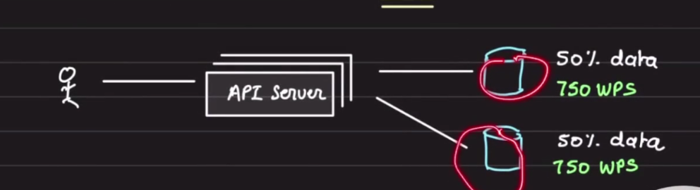

# Sharding and Partitioning

## Sharding

Sharding is a method of distributing data across multiple machines.

## Partitioning

Partitioning involves splitting a subset of data within the same instance.

## How a Database is Scaled?


A database server is just a database process (MySQL, MongoDB) running on an EC2 machine using a port.

You put your database in production, serving real traffic. (100 WPS - writes per second)


As you get more users, your database struggles to manage the load. You scale up your database by adding more CPU, RAM, and Disk.


Now it can handle 200 WPS.

Your product goes viral, and your database is again unable to handle the load, so you scale up again.


With two clicks in GCP or AWS, you scale up and now can handle 1000 WPS.

But after a certain stage, vertical scaling has its limits.

You then resort to **Horizontal Scaling**.

Say one DB server was handling 1000 WPS and cannot scale beyond that, but now you need to handle 1500 WPS. You scale horizontally and split the data.



By adding one more database server, the load reduces to 750 WPS on each node, handling higher throughput.

Each database server is called a **"Shard"**.  
We say that the data is **partitioned** across multiple shards.

## Understanding Partitioning


Each partition can either live on one database server or share a server with other partitions.

This depends on the **number of shards** you have.


A dataset of **100 GB** is partitioned across **2 shards**.

## How to Partition the Data?

There are two categories of partitioning:

1. **Horizontal Partitioning**
2. **Vertical Partitioning**

When splitting **100 GB** of data, the choice of partitioning method depends on **load, use case, and access pattern**.


### Scenarios:

1. **No Partitioning / No Sharding**

   - A single database server with a single database instance.
   - All data is stored in one place, like a **monolithic application**.

2. **Data Partitioning but No Sharding**

   - A single database server with **multiple database instances**.
   - Each instance contains a **subset of data**.

3. **Data Partitioning and Sharding**

   - Multiple database servers with **multiple database instances**.
   - Each instance has a **subset of data**.

4. **Sharding but No Partitioning**
   - Multiple database servers with a **single database instance** per server.
   - All data is stored in it (e.g., read replicas).

## Advantages of Sharding:

- Handles **large reads and writes**
- Increases **overall storage capacity**
- Improves **availability**

## Disadvantages of Sharding:

- **Operational complexity**
- **Cross-shard queries are expensive**

---

### **What are Cross-Shard Queries?**

A **cross-shard query** is a database query that requires data from multiple shards to be processed together. Since the data is distributed across multiple database instances (shards), the query has to **fetch, aggregate, and process** data from multiple sources instead of a single database.

---

### **Why Are Cross-Shard Queries Expensive?**

1. **Multiple Network Calls**

   - Since data is spread across different shards, a query needs to **fetch data from multiple database servers**, leading to higher **network latency**.

2. **Increased Query Complexity**

   - The query cannot be executed with a simple SQL statement on a single database. Instead, it requires **query coordination**, **aggregation**, and **result merging** across shards.

3. **Lack of Joins Across Shards**

   - If you need to perform a **JOIN** operation between tables that are located in different shards, you cannot do it **directly**. Instead, you need to:
     - Query each shard separately
     - Aggregate results at the application level
     - Perform additional processing, which increases **compute cost**

4. **Inconsistent Query Performance**

   - Some shards may have **more data** than others, leading to an **uneven query execution time**. The slowest shard dictates the overall response time.

5. **Indexing Challenges**
   - Each shard manages its own indexes, and when querying across shards, the database cannot use a **single global index**, which leads to inefficient query execution.

---

### **Example of a Cross-Shard Query**

Imagine a system where **users** are stored in different shards based on their country:

- **Shard 1**: Users from the USA
- **Shard 2**: Users from India
- **Shard 3**: Users from Germany

Now, you run this query:

```sql
SELECT COUNT(*) FROM users WHERE age > 30;
```

- Since **users** are spread across multiple shards, the system must:
  1. Send the query to **each shard**
  2. Aggregate the results
  3. Return the final count

If each shard holds **millions of records**, the query takes longer and consumes **more resources** than if all data were in a single database.

---

### **How to Mitigate Cross-Shard Query Costs?**

- **Keep related data in the same shard** (Shard by User ID, Tenant ID, etc.)
- **Use caching** to avoid repeated cross-shard queries
- **Pre-aggregate data** to reduce query complexity
- **Denormalize data** to avoid expensive JOINs across shards
- **Use distributed query engines** (e.g., Presto, Apache Druid)

By designing sharding strategies wisely, you can **minimize cross-shard queries** and improve overall system performance. 🚀

## https://chatgpt.com/share/67ae3987-9508-800d-8bc7-05df611a8704
